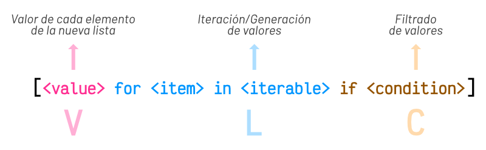
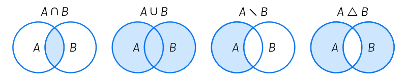
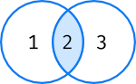
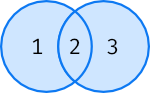
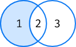
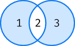
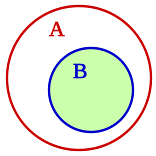

# Python Apuntes

## Variables

Los nombres de variables en Python solo pueden contener valores alfanuméricos en
el rango de **(A-Z, a-z, 0-9, \_)**
como se ve también el carácter especial guion bajo o (underscore en inglés) "\_".

- No se admiten otros caracteres especiales en el nombre de las variables excepto el
  ya mencionado guion bajo o underscore en inglés "\_".
- Las variables deben **iniciar siempre** con una letra o un guion bajo, pero nunca con
  un número esto provocaría un error de sintaxis.
- Las variables que están compuestas por mas de una palabra deberán separarse con guion bajo ej: **temperatura_media**.
- Los nombres de las variables son case-sensitive, esto quiere decir que distingue entre mayúsculas y minúsculas, por lo cual las variables **nombre, Nombre** y **NOMBRE** serán tres variables distintas (ojo con esto).
  > **Mal:** `$nombre`, `nombre%`, `nombre&apellido`, `nombre-apellido`, `9gatos`
  >
  > **Bien:** `_nombre`, `nombre_apellido`, `nombreApellido`, `Joe90`, `Joe_90`

## Tipos de Datos

### Datos numéricos

En Python no existe un limite para el número máximo que podemos representar, el limite esta dado por los recursos del hardware que utilicemos.

#### Tipos de datos numéricos:

- _Enteros_: 1, 10, 38, 1985
- _Flotantes_: 2.3, 54.50, 3.141638

### Booleanos

Los booleanos son los valores de representación de verdad y deben iniciar con mayúsculas. Estos valores son importantes para los **condicionales** y los **bucles o loops**.

- _True_: (verdadero)
- _False_: (falso)

## Cadenas de Caracteres (String)

Son secuencias de caracteres encerrados entre comillas y usados para representar texto en el programa. Estas cadena pueden ir encerradas entre comillas dobles o simples.

#### Ejemplo:

```py
nombre = "Pepe" o nombre = 'Pepe'
```

Para determinar el tamaño o longitud de una cadena (cantidad de caracteres que posee) se utiliza la función **len()**.

```py
nombre = "Anastasia"
len(nombre)    # Retorna la cantidad de caracteres en este caso 9.
```

### Estructura de un String

La estructura del string es como una matriz o arreglo de una dimensión indexada por enteros y al igual que todo arreglo comienza con el indice 0 (cero). Ej:

```py
cadena = "Probando"
# indice  01234567
```

**Nota:** A diferencia de los arreglos o matrices estas no pueden ser modificadas como se vera posteriormente.

### Indexing

Si queremos acceder a algún carácter individual del string utilizamos el método de **indexación** cuya sintaxis es `<string>[<indice>]` Ej:

```py
"Probando"[3] nos dará como resultado 'b'
```

Si indicamos un indice que esta fuera del rango de indices del string nos dará un error: **IndexError**

```py
"Probando"[8] nos dará como resultado "IndexError"
```

Las cadenas string no pueden ser modificadas como las matrices o arreglos:

```py
text = "Probando"
text[3] = "c" nos dará TypeError: 'str' object does not support item assignment
```

### f-string

Se utiliza para poner valores dentro de un string. Ejemplo:

```py
nombre = "Pepe"
texto = f"Mi nombre es {nombre}"
print(texto)
>>> Mi nombre es Pepe
```

También para números flotantes se puede usar `{variable:,}` la `,` después del `:` es el separador de miles, puede usarse el que corresponda
según el uso de la región. También usando el `.2f` (el dos indica la cantidad de decimales o precisión), de esta manera se puede dar formato de salida a los valores.

```py
num = 1000000.5378
print(f"{num:,.2f}")
>>> 1,000,000.54
```

### Métodos de Cadenas de Caracteres

Son operaciones comunes que vienen implementadas en Python. Los métodos son parecidos a funciones pero están asociados a un elemento o valor en particular.<br>
Sintaxis: `<string>.<método>(<valores>)`<br>
Métodos mas comunes:

- `.capitalize()`: Este método retorna **una copia** del string con el primer carácter en mayúsculas y el resto en minúsculas.

```py
nombre = "roberto"
nombre.capitalize() retorna "Roberto"
```

Otros métodos muy usados:

- `.find(), .index()`: Son utilizados para búsquedas.
- `.isalnum()`: Retorna `True` si todos los caracteres son alfanuméricos. `([a-Z][0-9])`<br>
  **Nota:** Se puede usar para verificar caracteres no alfanuméricos usando "if not", "!=" etc. También retorna `False` con espacios en blanco.

```py
string = "Ricardo10"
string1 = "Ricardo 10"
string2 = "Ricardo@gmail.com"
string.isalnum() Retorna True
string1.isalnum() Retorna False
string2.isalnum() Retorna False
```

- `.isalpha()`: Retorna True si todos los caracteres son alfabéticos.
- `.isdecimal()`: Retorna True si todos los caracteres son decimales.
- `.isdigit()`: Retorna True si todos los caracteres son dígitos.
- `.islower()`: Retorna True si todos los caracteres están en minúsculas.
- `.isupper()`: Retorna True si todos los caracteres están en mayúsculas.

Todos los métodos que comienzan en **is** retornan un booleano y son muy utilizados en los condicionales lógicos.

- `.lower()`: Retorna una **copia de la cadena** con todos sus caracteres en minúsculas (excepto caracteres especiales).
- `.casefold()`: Funciona similar a `.lower()` pero de forma mas agresiva incluyendo las minúsculas que correspondan a los caracteres especiales.
- `.upper()`: Retorna una **copia de la cadena** con todos sus caracteres en mayúsculas.

## Ejemplo búsqueda de vocales:

```py
# Función que retorna la cantidad de vocales de un texto.
def vowels_in_string(text):
    vowels = "aeiou"
    counter = 0

    for char in text:
        if char.lower() in vowels:
            counter += 1

    return counter
```

## La Función type()

La función `type()` Retorna el tipo de un valor determinado.<br>
Sintaxis: `type(<valor o variable>)`

```py
type(35)     Retorna <class 'int'>
type(3.2)    Retorna <class 'float'>
type(True)   Retorna <class 'bool'>
type("Pepe") Retorna <class 'str'> (string)
```

## String Avanzados

### Convertir String a Listas y Viceversa

#### Dividir una cadena de texto en lista

`split()`: Una tarea muy común al trabajar con cadenas de texto es dividirlas por algún tipo de separador. En este sentido, Python nos ofrece la función `split()`, que debemos usar anteponiendo el «string» que queramos dividir:

```py
>>> proverb = 'No hay mal que por bien no venga'
>>> proverb.split()
['No', 'hay', 'mal', 'que', 'por', 'bien', 'no', 'venga']

>>> tools = 'martillo,sierra,destornillador'
>>> tools.split(',')
['martillo', 'sierra', 'destornillador']
```

La función `split()` devuelve una lista donde cada elemento es una parte de la cadena de texto original

**Nota:** Si no se especifica un separador, `split()` usa por defecto cualquier secuencia de espacios en blanco, tabuladores y saltos de línea.

#### Particionado de cadenas de texto (retorna una tupla)

`partition`: Existe una forma algo más «elaborada» de dividir una cadena a través del particionado. Para ello podemos valernos de la función `partition()` que proporciona Python.

Esta función toma un argumento como separador, y divide la cadena de texto en 3 partes: lo que queda a la izquierda del separador, el separador en sí mismo y lo que queda a la derecha del separador:

```py
>>> text = "3 + 4"
>>> text.partition('+')
('3', '+', '4') # Retorna una tupla
```

**Nota:** En este caso el resultado de la función `partition()` es una tupla.

Esa tupla resultante puede pasarse a una lista:

```py
>>> list(text.partition('+'))
['3', '+', '4']
```

#### Unir una lista en cadena de texto (string)

`join()`: Dada una lista, podemos convertirla a una cadena de texto, uniendo todos sus elementos mediante algún separador. Para ello hacemos uso de la función `join()` con la siguiente estructura `<separador>.join(<lista>)`:

```py
>>> shopping = ['Agua', 'Huevos', 'Aceite', 'Sal', 'Limón']

>>> ','.join(shopping)
'Agua,Huevos,Aceite,Sal,Limón'

>>> ' '.join(shopping)
'Agua Huevos Aceite Sal Limón'

>>> '|'.join(shopping)
'Agua|Huevos|Aceite|Sal|Limón'
```

**NOTA: Hay que tener en cuenta que `join()` sólo funciona si todos sus elementos son cadenas de texto**

### Formateo de Strings

#### Formateo con el operador %

El formateo de string se realiza por medio del símbolo `%` e indicando el tipo de dato: `"%<tipo dato> %<tipo dato>" % (<variable1, variable2, <variable...n)`

```py
a = "Hola"
b = "Pepe"
c = 10
d = 15.23

print("%s %s" % (a, b)) # s = string
>>> Hola Pepe

print("%s %i" % (b, c)) # i = integer
>>> Pepe 10

print("%s %f" % (b, d)) # f = float
>>> Pepe 15.230000
```

**Nota**: En los float para indicar el numero de decimales a mostrar se le coloca delante de la `f` un punto `.` y la cantidad de decimales. Ej: `%.2f`.

#### Formateo de strings con el método format

En el formateo usando format se agregan llaves por cada variable a incluir ya que las toma en orden de las mismas.

```py
saludo = "Hola"
nombre = "Pepe"
edad = 23

"{} {} tienes {} años.".format(saludo, nombre, edad)
>>> 'Hola Pepe tienes 23 años.'
```

#### Texto pre-formateado

Para tener un texto pre-formateado que respete espacios, tabulaciones y saltos de linea, se debe encerrar en triple comillas `"""` al igual que en los comentarios multi-lineas.<br>
Esto funciona como el tag `<pre>` en HTML.

```PY
texto = """Aquí me pongo a "cantar"
Al compás de la vigüela
Que al hombre que lo desvela
Una pena estrordinaria,
Como la ave solitaria
Con el 'cantar' se consuela."""

texto2 = """Aquí "comillas dobles" y aquí 'comillas simples'."""

print(texto)
>>>
Aquí me pongo a "cantar"
Al compás de la vigüela
Que al hombre que lo desvela
Una pena estrordinaria,
Como la ave solitaria
Con el 'cantar' se consuela.

print(texto2)
>>> Aquí "comillas dobles" y aquí 'comillas simples'.
```

Como puedes ver tanto en texto multi-linea como en una sola al colocarlo entre `"""` se pueden utilizar las comillas dobles y simples sin problema.

### Multiplicar strings

Es tan simple como uno operación matemática.

```py
text = "Hola"
print(text*3)
>>> HolaHolaHola

# Agregando espacios
print((text + " ") * 3)
>>> Hola Hola Hola
```

### Comprobar coincidencias dentro de un string

Se utiliza la sentencia `in` y la negación `not in` para hacer las comprobaciones y retorna un booleano.

```py
print("lo" in "Carlo Magno")
>>> True

print("lo" not in "Carlo Magno")
>>> False
```

## Recibiendo Datos del Usuario (input)

Para solicitar datos al usuario se utiliza la función `input()`<br>
Sintaxis: `<variable> = input(<mensaje>)`

```py
num = input("Ingrese un Número: ")
print(num)

Ejecución:
Ingrese un Número: 5
5
```

**`Advertencia:`** La función input() siempre retorna una **cadena de caracteres (string)** independientemente del tipo de dato que ingrese el usuario. Ojo al piojo, siempre hay que convertir el retorno del `input()` al tipo de dato que se requiera.<br>
Ejemplo:

```py
num = int(input("Ingrese un Número: "))
print(num)
print(type(num))

Ejecución:
Ingrese un Número: 5
5
<class 'int'>
```

## Operadores

Los **Operadores** son símbolos que denotan una operación en el programa.<br>
Los **Operandos** son valores con los cuales se ejecuta la operación.<br>
Los **Operadores** y los **Operandos** se juntan para formar una **Expresión**<br>

```py
Operador + Operando = Expresión
```

La **Expresión** es la combinación de **valores**, **variables**, y **operadores** que al ser evaluados resultan en un **valor**.<br>
Este concepto es **muy importante** en programación, se **evalúa** una **expresión** para obtener un valor final.

- Las Expresiones se evalúan de **izquierda a derecha** excepto cuando ciertos operadores de mayor "importancia o precedencia" para el orden de las operaciones al igual que en las matemáticas.

### Tipos de Operadores

#### Aritméticos

- Suma: `3 + 2` = 5 En el caso de strings concatena `"Hola" + " " + "Mundo!"` = "Hola Mundo!".
- Resta: `3 - 2` = 1
- Multiplicación: `3 * 2` = 6
- División: `4 / 2` = 2.0 En la división el resultado **siempre** es un número de coma flotante (float).
- División Entera: `5 // 3` = 1 este operador devuelve un entero **truncando** los valores decimales **no los redondea** y solo devuelve un flotante cuando los operandos son de coma flotante, pero usa el mismo procedimiento de truncar los decimales Ej: `5.0 // 3.0` = 1.0 Es muy utilizado para **Búsqueda Binaria**.
- Exponente: `2 ** 3` = 8 Puede obtenerse la raíz cuadrada aplicando la exponenciación a (1/2) Ej: `16 ** (1/2)` = 4.0 y también sigue la regla de todo número elevado a cero (0) es igual a 1 Ej: `5 ** 0` = 1
- Módulo: `5 % 2` = 1 Este operador devuelve el resto de la división, es muy utilizado para verificar si un número es par.

El orden básico de las operaciones aritméticas puede ser recordado con el acrónimo<br>**PEMDAS**

- `P`arentesis: Todas las operaciones dentro de paréntesis.
- `E`xponentes: Tienen la mayor precedencia luego de los paréntesis.
- `M`ultiplicación: Tienen la mayor precedencia luego de los exponentes.
- `D`ivisión: Tiene la mayor precedencia luego de la multiplicación.
- `A`ddition: (suma) Tiene la mayor precedencia luego de la división.
- `S`ubtraction: (resta) Tiene la mayor precedencia luego de la suma.<br>

#### Lógicos

Nos permiten trabajar con valores booleanos (**True**, **False**).

- **and** : Solo retorna True cuando los dos operandos son verdaderos.

  |   x   |   y   | x and y |
  | :---: | :---: | :-----: |
  | True  | True  |  True   |
  | True  | False |  False  |
  | False | True  |  False  |
  | False | False |  False  |

  ```py
  (5 < 6) and ( 6 > 8) : False
    True        False  : False
  ```

- **or** : Evalúa si cualquiera de los operandos es verdadero el resultado es verdadero.

  |   x   |   y   | x or y |
  | :---: | :---: | :----: |
  | True  | True  |  True  |
  | True  | False |  True  |
  | False | True  |  True  |
  | False | False | False  |

  ```py
  (5 < 6) or ( 6 > 8) : True
    True       False  : True
  ```

- **not** : Este operador niega el valor de la expresión. -
  |x| not x|
  |:----:|:----:|
  |True|False|
  |False| True|

  ```py
  not (5 < 6) : False
  not  True   : False
  ```

El orden de prioridad cuando tenemos varios operadores lógicos en una expresión, se evalúan de esta manera: primero **not** luego **and** y finalmente **or**. Cuando tenemos varios operadores con el mismo orden de prioridad, se evalúan de izquierda a derecha.

#### De Asignación

Son utilizados para **asignar valores** a las variables del programa.

|     Asigna      |   Incrementa   |
| :-------------: | :------------: |
|        =        |       +=       |
| **Decrementa**  | **Multiplica** |
|       -=        |      `*=`      |
|   **Divide**    |  **Potencia**  |
|       /=        |     `**=`      |
| **Div. Entera** | **Resto Div.** |
|       //=       |       %=       |

```py
Ej: variable = 10
    variable += 5 >>> 15
    variable /= 3 >>>  5.0
    variable *= 3 >>> 15.0
```

#### Relacionales

Son utilizados para **comparar valores** y retornan un **valor booleano**.
|||||
|:---:|:---:|:---:|:---:|
|>| mayor que|>=| mayor o igual que|
|<| menor que|<=| menor o igual que|
|==| igual que|!=| distinto que|

```py
5 > 5 : False
5 >= 5 : True
8 == 8 : True
8 != 8 : False
"hola" == "bola" : False
```

En el caso de las cadenas (strings) la comparación las hace siguiendo el orden del diccionario para evaluarlo, también el tamaño de la cadena cuenta en la evaluación.

```py
"ABC" < "A" : False
"A" < "B" : True
"C" != "D" : True
"Noris" == "Gino" : False
```

## Sentencias Condicionales

Son una **instrucción** o un **grupo** de **instrucciones** cuya ejecución depende del valor de una **condición booleana**.<br>

### Sentencia if

```py
Sintaxis:
    if <condición>:
        # código
```

Debe escribirse el if espacio la condición seguida de **:** e indentar el código debajo para que el compilador identifique que código depende del condicional y cual del programa principal.

```py
temp = 15
if temp < 25:
    print("Que frío lo pario!")
```

#### Sentencia else

Esta sentencia es para resolver que se debe hacer si no se cumple la condición y ejecutar otro código si fuera necesario.

```py
Sintaxis:
    if <condición>:
        # código si cumple la condición
    else:
        # código si no cumple la condición
# código del programa general
```

```
temp = 27
if temp < 25:
    print("Que frío lo pario!")
else:
    print("Que calor de locos!)
Ejecución:
Que calor de locos!
```

#### Sentencia elif

Permite especificar otras condiciones y como manejar esas condiciones.

```py
Sintaxis:
    if <condición1>:
        # código
    elif <condición2>:
        # código
    else:
        # código
    # código del programa general.
```

```py
temp = 15
if temp <=0:
    print("Frío que pelaaa!")
elif temp < 25:
    print("Que frío lo pario!")
else:
    print("Que calor de locos!")
```

**`Advertencia:`** Pueden haber varias sentencias **elif** en un condicional pero **solo una** sentencia **else**. La clausula else debe ser única en un condicional y que va a ser un respaldo cuando todas las otras condiciones sean falsas.

### Match

```py
def http_error(status):
    match status:
        case 400:
            return "Bad request"
        case 404:
            return "Not found"
        case 418:
            return "I'm a teapot"
        case _:
            return "Something's wrong with the internet"
```

[Documentación de match](https://docs.python.org/es/dev/tutorial/controlflow.html#match-statements)

## Comentarios (comentar código)

Un comentario es un texto que se escribe en el programa para facilitar su comprensión.
La función principal de los comentarios es, describir la lógica de ciertas partes del código a otros programadores que lean el programa.
Los comentarios deben hacerse comenzando con `#`

```py
# Este es un comentario
num = 3 ** 5 # este es otro comentario
```

Para comentar código en un bloque se utiliza `'''` (tres comillas simples) al principio y al final del bloque, también puedes utilizar comillas dobles `"""`.

```py
'''
Este es un bloque de comentario
en varios renglones, se inicia y
finaliza con tres comillas simples.
'''

"""
Este es un bloque de comentario
en varios renglones, se inicia y
finaliza con tres comillas dobles.
"""
```

## Range

Me es preciso explicar la utilización del **range()** aunque hay conceptos mas avanzados en la explicación, pero que se verán con posterioridad, pero
harán que sea mas claro su uso en su momento.

### Uso del Range:

El `range()` genera un **iterable** con una secuencia de números que van desde `0` por defecto hasta el número que se pasa como parámetro menos `1`. En realidad, se pueden pasar hasta tres parámetros separados por coma, donde el primero es el **inicio de la secuencia**, el segundo es **final** y el tercero es **salto que se desea entre números**. Por defecto se empieza en `0` y el salto es de `1`.

```py
range(inicio, final, paso)
```

### Ejemplos

```py
# Genera un iterable de números del 0 al 5
for i in range(6):
    print(i)
```

```py
# Genera un iterable de números pares del 2 al 10
for i in range(2, 11, 2):
    print(i)
```

### Tips

Se pueden generar también secuencias **inversas**, empezando por un número **mayor** y terminando en uno **menor**, pero para ello el salto deberá ser **negativo**.

```py
# Genera un iterable de números de mayor a menor del 10 al 1
for i in range(10, 0, -1):
    print(i)
```

## Estructura de Datos (Listas, Tuplas, Diccionarios, Conjuntos)

## Listas

Es una **estructura de datos** utilizada para almacenar múltiples valores en secuencia.
Los valores son almacenados en **secuencias ordenadas** cada uno de los elementos tiene su propia secuencia mediante un índice (**index**).

```py
varios = [1, 2, "peras", True, 3.4]
```

Aunque está permitido, **NUNCA** llames `list` a una variable porque **destruirías la función que nos permite crear listas**. Y tampoco uses nombres derivados como `_list` o `list_` ya que no son nombres representativos que identifiquen el propósito de la variable.

### Características

- Secuencia ordenada de valores.
- Puede contener valores de cualquier tipo.
- Puede contener valores de distintos tipos.
- Cada posición en la lista está asociada a un entero llamado **índice**.
- Es **mutable**. Lo que significa que podemos **añadir**, **eliminar** o **modificar** sus elementos.

### Conversión

Para convertir otros tipos de datos en una lista podemos usar la función `list()`:

```py
>>> # Conversión desde una cadena de texto
>>> list("Python")
['P', 'y', 't', 'h', 'o', 'n']
```

Si nos fijamos en lo que ha pasado, al convertir la cadena de texto Python se ha creado una lista con 6 elementos, donde cada uno de ellos representa un carácter de la cadena. Podemos extender este comportamiento a cualquier otro tipo de datos que permita ser iterado **(iterables)**.

Existe una manera particular de usar list() y es no pasarle ningún argumento. En este caso estaremos queriendo convertir el «vacío» en una lista, con lo que obtendremos una lista vacía:

```py
>>> list()
[]
```

**Para crear una lista vacía, se suele recomendar el uso de [] frente a list(), no sólo por ser más pitónico sino por tener (en promedio) un mejor rendimiento en tiempos de ejecución.**

### Acceder a un elemento

Para acceder a un elemento de la lista, usamos su índice correspondiente.<br>
Sintaxis: `<lista>[<índice>]`

```py
lista = ["perro", "Juan", 3, True]
# índice:   0        1    2    3

print(lista[0])
$ perro

print(lista[1])
$ Juan

```

Las cadenas de texto (**strings**) se comportan como listas se puede acceder a cada uno de los elementos por medio de su indice.

```py
cadena = "murciélago"
print(cadena[2])

$ r
```

A diferencia de de las **listas** un **string** no es mutable por lo cual cuando se quiera cambiar alguno de sus valores generara un error.

```py
lista = ["banana", "pera", "manzana"]
cadena = "Comer"

lista[1] = "uva"
print(lista)
$ ['banana', 'uva', 'manzana']

cadena[0] = "P"
$ TypeError: 'str' object does not support item assignment

```

### Slice o Rebanada

Se puede acceder a varios elementos descartando otros tomando una porción (slice) de una lista (creando una nueva sin modificar la existente) y se usa la siguiente sintaxis:<br>
`lista[<indice_inicial> : <indice_final>]` donde el **indice_inicial** es `inclusivo` y el **indice_final** es `exclusivo`.<br>
**Nota:** Cuando usamos slice el indicar **un _indice fuera del rango_ no genera _error_**.

```py
fruta = ["banana", "pera", "manzana", "coco"]
    index:  0         1        2         3
print(fruta[1:3])
$ ['pera', 'manzana']
```

Dejando el primer valor o el ultimo o ambos vacíos se pueden establecer rangos como:

- `lista[:3]` desde el inicio de la lista, hasta el indice indicado
- `lista[2:]` desde el indice indicado al final de la lista.
- `lista[:]` toda la lista (no me parece practico pero no esta mal mencionarlo)

#### Paso o Pass

El paso se utiliza para pasar de algunos elementos, su sintaxis es `lista[<idice_inicio>:<inidice_final>:<paso>]`

```py
frutas = ["pera", "banana", "manzana", "uva", "melon", "sandia"]
print(frutas[1:5:2])
$ ['banana', 'uva']

print(frutas[::2])
$ ['pera', 'manzana', 'melon']

print(frutas[0:6:3])
$ ['pera', 'uva']
```

#### Eliminar o Modificar elementos de la lista

Usando slice (rebanar) es posible **eliminar** o **modificar** elementos de la lista:

- Eliminar por rango:
  ```py
  >>> shopping = ['Agua', 'Huevos', 'Aceite', 'Sal', 'Limón']
  >>> shopping[1:4] = []
  >>> shopping
  ['Agua', 'Limón']
  ```
- Modificar por rango:
  ```py
  >>> shopping = ['Agua', 'Huevos', 'Aceite', 'Sal', 'Limón']
  >>> shopping[1:4] = ['Banana', 'Pera', 'Manzana']
  >>> shopping
  ['Agua', 'Banana', 'Pera', 'Manzana', 'Limón']
  ```

### Indice negativo

El indice negativo se utiliza para seleccionar un elemento desde el final de la cadena y de esta hacia la izquierda, donde el indice `[-1]` pertenece al ultimo elemento de la cadena.

```py
fruta = ["banana", "pera", "manzana", "coco"]

print(fruta[-1])
$ coco

print(fruta[-2])
$ manzana

print(fruta[1:-2])
$ ['pera']

print(fruta[-3:-1])
$ ['pera', 'manzana']
```

### Métodos para operar con listas

- `append()` agrega un elemento al final de la lista `<lista>.append(<elemento>)`
  ```
  nums = [1, 2, 3, 4]
  nums.append(5)
  print(nums)
  >>> [1, 2, 3, 4, 5]
  ```
- `insert()` Inserta un elemento en un índice especifico `<lista>.insert(<índice>, <elemento>)`
  ```
  nums = [1, 2, 3, 4, 5]
  nums.insert(0, 6)
  print(nums)
  >>> [6, 1, 2, 3, 4, 5]
  ```
- `del` Elimina un elemento de lista por medio de su indice: `del <lista>[<indice>]`
  ```py
  >>> shopping = ['Agua', 'Huevos', 'Aceite', 'Sal', 'Limón']
  >>> del shopping[3]
  >>> shopping
  ['Agua', 'Huevos', 'Aceite', 'Limón']
  ```
- `remove()` Elimina un elemento, este método nos permite eliminar la primera ocurrencia del elemento especificado en los paréntesis: `<lista>.remove(<elemento>)`

  ```py
  >>> shopping = ['Agua', 'Huevos', 'Aceite', 'Sal', 'Limón']
  >>> shopping.remove('Sal')
  >>> shopping
  ['Agua', 'Huevos', 'Aceite', 'Limón']
  ```

  Si intentamos remover un valor que no existe en la lista nos dará un **ERROR**
  **NOTA: Si existen valores duplicados, la función `remove()` sólo borrará la primera ocurrencia.**

- `pop()` La sentencia `del` y la función `remove()` efectivamente borran el elemento indicado de la lista, pero no «devuelven» nada. Sin embargo, Python nos ofrece la función pop() que además de borrar, nos «recupera» el elemento; algo así como una extracción. Lo podemos ver como una combinación de acceso + borrado:

  ```py
  >>> shopping = ['Agua', 'Huevos', 'Aceite', 'Sal', 'Limón']
  >>> product = shopping.pop()  # shopping.pop(-1)
  >>> product
  'Limón'
  >>> shopping
  ['Agua', 'Huevos', 'Aceite', 'Sal']

  >>> product = shopping.pop(2)
  >>> product
  'Aceite'
  >>> shopping
  ['Agua', 'Huevos', 'Sal']
  ```

  Si usamos la función `pop()` sin pasarle ningún argumento, por defecto usará el índice `-1`, es decir, el último elemento de la lista. Pero también podemos indicarle el índice del elemento a extraer.

- **Borrado completo de una lista**

  Python nos ofrece, al menos, dos formas para borrar una lista por completo:

  - Utilizando la función `clear()`:
    ```py
    >>> num = [1, 2, 3, 4]
    >>> num.clear() # Borra in situ
    >>> num
    []
    ```
  - «Reinicializando» la lista a vacío con `= []`:
    ```py
    >>> num = [1, 2, 3, 4]
    >>> num = []    # Nueva zona de memoria
    >>> num
    []
    ```

  La diferencia entre ambos métodos tiene que ver con cuestiones internas de gestión de memoria y de rendimiento, mientras que `clear()` mantiene la misma posición de memoria, `= []` crea una nueva posición de memoria. La memoria que queda «en el limbo» después de asignar un nuevo valor a la lista es detectada por el recolector de basura de Python, quien se encarga de liberar aquellos datos que no están referenciados por ninguna variable.

  A efectos de velocidad de ejecución, `clear()` «parece» ir más rápido que `= []`.

- `in` Verifica si un elemento esta en la lista `<elemento> in <lista>`

  ```py
  lista = [1, 2, "Pepe", 4, 5]
  "Pepe" in lista
  >>> True
  ```

  Devuelve un booleano que puede usarse en un condicional:

  ```py
  if "Pepe" in lista:
      print("Pepe se encuentra en la lista!")
  else:
      print("Nadie sabe donde esta Pepe")

  >>> "Pepe esta en la lista!"
  ```

- `not in` Es la negación, si no esta en la lista retorna `True`.

  ```py
  if "Ana" not in lista:
    print("Ana no esta en la lista!")
  else:
    print("Ana esta en la lista")

  >>> Ana no esta en la lista
  ```

- `index()` Retorna el índice de la primera ocurrencia del elemento en la lista. Si no se encuentra el elemento, ocurre un error. `<lista>.index(<elemento>)`
  ```py
  nombre = ["Ana", "Juan", "Francisco","Juan"]
  nombre.index("juan")
  >>> 1
  ```

### Modificar valores de una lista

- **Por su índice:** Para cambiar un valor en una lista se utiliza la siguiente sintaxis: `<lista>[<índice>] = <nuevo_valor>`

  ```py
  >>> nums = [1, 2, 3, 4]
  >>> nums[2] = 6
  >>> nums
  [1, 2, 6, 4]
  ```

  En el caso de acceder a un **índice no válido** de la lista, incluso para modificar, obtendremos un error

### Combinar Listas

Python nos ofrece dos aproximaciones para combinar listas:

- **Conservando la lista original**. Mediante el operador `+` o `+=`:

  ```py
  >>> shopping = ['Agua', 'Huevos', 'Aceite']
  >>>fruitshop = ['Naranja', 'Manzana', 'Piña']
  >>> shopping + fruitshop
  ['Agua', 'Huevos', 'Aceite', 'Naranja', 'Manzana', 'Piña']
  ```

- **Modificando la lista original**. Mediante la función `extend()`:
  ```py
  >>> shopping = ['Agua', 'Huevos', 'Aceite']
  >>> fruitshop = ['Naranja', 'Manzana', 'Piña']
  >>> shopping.extend(fruitshop)
  >>> shopping
  ['Agua', 'Huevos', 'Aceite', 'Naranja', 'Manzana', 'Piña']
  ```
  Hay que tener en cuenta que `extend()` funciona adecuadamente si pasamos una lista como argumento. En otro caso, quizás los resultados no sean los esperados. Veamos un ejemplo:
  ```py
  >>> shopping = ['Agua', 'Huevos', 'Aceite']
  >>> shopping.extend('Limón')
  >>> shopping
  ['Agua', 'Huevos', 'Aceite', 'L', 'i', 'm', 'ó', 'n']
  ```
  El motivo es que `extend()` «recorre» (o itera) sobre cada uno de los elementos del objeto en cuestión. En el caso anterior, al ser una cadena de texto, está formada por caracteres. De ahí el resultado que obtenemos.

### Iterar sobre una lista

Al igual que hemos visto con las cadenas de texto, también podemos iterar sobre los elementos de una lista utilizando la sentencia `for`:

```py
>>> shopping = ['Agua', 'Huevos', 'Aceite', 'Sal', 'Limón']

>>> for product in shopping:
...     print(product)
...
Agua
Huevos
Aceite
Sal
Limón
```

### Iterar Usando Enumeración

`enumerate()`: Hay veces que no sólo nos interesa «visitar» cada uno de los elementos de una lista, sino que también queremos saber su **índice** dentro de la misma. Para ello Python nos ofrece la función `enumerate()`:

```py
>>> shopping = ['Agua', 'Huevos', 'Aceite', 'Sal', 'Limón']

>>> for i, product in enumerate(shopping):
...     print(i, product)
...
0 Agua
1 Huevos
2 Aceite
3 Sal
4 Limón
```

Es posible utilizar el parámetro `start` con `enumerate()` para indicar el índice en el que queremos comenzar. Por defecto es `0`.

```py
for i, product in enumerate(shopping, start=2): # De esta forma imprime a partir del indice 2 inclusive
```

### Iterar sobre múltiples listas

`zip()`: Python ofrece la posibilidad de iterar sobre múltiples listas en paralelo utilizando la función `zip()`. Se basa en ir «juntando» ambas listas elemento a elemento:

```py
>>> shopping = ['Agua', 'Aceite', 'Arroz']
>>> details = ['mineral natural', 'de oliva virgen', 'basmati']

>>> for product, detail in zip(shopping, details):
...     print(product, detail)
...
Agua mineral natural
Aceite de oliva virgen
Arroz basmati
```

En el caso de que las listas no tengan la misma longitud, la función `zip()` realiza la combinación hasta que se agota la lista más corta.

### Comparación de Listas

La comparación entre listas se hace de forma analógica elemento a elemento, que tengan los mismos elementos en distinto orden afecta a la comparación.

```py
>>> a = [1, 2, 3]
>>> b = [1, 2, 4]
>>> a > b
False
```

Hay que ver mas sobre el tema de mayor y menor que se me hace un poco confuso.

### Cuidado con las copias

Las listas son estructuras de datos mutables y esta característica nos obliga a tener cuidado cuando realizamos copias de listas, ya que la modificación de una de ellas puede afectar a la otra.

Veamos un ejemplo sencillo:

```py
>>> original_list = [4, 3, 7, 1]
>>> copy_list = original_list
>>> original_list[0] = 15

>>> original_list
[15, 3, 7, 1]
>>> copy_list
[15, 3, 7, 1]
```

Una posible solución a este problema es hacer una «copia dura». Para ello Python proporciona la función `copy()`:

```py
>>> original_list = [4, 7, 3, 1]
>>> copy_list = original_list.copy()
>>> original_list[0] = 15
>>> original_list
[15, 7, 3, 1]
>>> copy_list
[4, 7, 3, 1]
```

**NOTA:** En el caso de que estemos trabajando con listas que contienen elementos mutables, debemos hacer uso de la función `deepcopy()` dentro del módulo copy de la librería estándar.

```py
>>>import copy # importamos la librería copy
>>> a = [1, 2, 3, [4, 5, 6], 7, 8, 9]
>>> b = copy.deepcopy(a)
>>> b
[1, 2, 3, [4, 5, 6], 7, 8, 9]
>>> a[0] = 7
>>> a[3][0] = 7 # Sin el deepcopy() la lista que guarda 'a' se vería modificada en las dos variables.
>>> a
[7, 2, 3, [7, 5, 6], 7, 8, 9]
>>> b
[1, 2, 3, [4, 5, 6], 7, 8, 9]
```

### Veracidad múltiple

Si bien podemos usar sentencias condicionales para comprobar la veracidad de determinadas expresiones, Python nos ofrece dos funciones «built-in» con las que podemos evaluar si se cumplen **todas** las condiciones `all()` o si se cumple **alguna** condición `any()`. Estas funciones trabajan sobre iterables, y el caso más evidente es una lista.

Supongamos un ejemplo en el que queremos comprobar si una determinada palabra cumple las siguientes condiciones:

- Su longitud total es mayor a `4`.
- Empieza por `'p'`.
- Contiene al menos una `'y'`.

Veamos la **versión con veracidad múltiple** usando `all()`, donde se comprueba que se cumplan todas las expresiones:

```py
>>> word = 'python'

>>> enough_len = len(word) > 4              # True
>>> right_beginning = word.startswith('p')  # True
>>> min_ys = word.count('y') > 1            # True

>>> is_cool_word = all([enough_len, right_beginning, min_ys])

>>> if is_cool_word:
...   print('Cool word!')
... else:
...   print('No thanks')
...
Cool word!
```

Veamos la **versión con veracidad múltiple** usando `any()`, donde se comprueba que se cumpla alguna expresión:

```py
>>> word = 'yeah'

>>> enough_len = len(word) > 4              # False
>>> right_beginning = word.startswith('p')  # False
>>> min_ys = word.count('y')                # True

>>> is_fine_word = any([enough_len, right_beginning, min_ys])

>>> if is_fine_word:
...   print('Fine word!')
... else:
...   print('No thanks')
...
Fine word!
```

Este enfoque puede ser interesante cuando se manejan muchas condiciones o bien cuando queremos separar las condiciones y agruparlas en una única lista.

A tener en cuenta la peculiaridad de estas funciones cuando trabajan con la **lista vacía**:

```py
>>> all([])
True
>>> any([])
False
```

### Listas Por Comprensión

Las **listas por comprensión** establecen una técnica para crear listas de forma más compacta basándose en el concepto matemático de **conjuntos definidos por comprensión**:

<div style="border: 1px solid; border-radius: 5px; width: 80%; padding: 8px">
Decimos que un conjunto está definido por compresión , si sus elementos se describen a través de propiedades que tienen en común.<br>
Un conjunto está definido por **extensión**, si se enumeran sus elementos.<br>

Por ejemplo: `A = {x / x es un número obtenido al lanzar un dado corriente}` es un conjunto<br>
definido por comprensión ya que sus elementos `“x”` se describen a través de una propiedad<br>
**“es un número obtenido al lanzar un dado corriente”**.

Esa expresión se lee: **“A es el conjunto formado por todos aquellos números que se obtengan al lanzar un dado”**.

Date cuenta que la frase escrita entre las llaves `({...})` está en **singular** y, sin embargo, se lee en **plural**.

Ese conjunto, expresado por extensión, es `A = {1,2,3,4,5,6}`.

</div><br>

Podríamos decir que su sintaxis sigue un modelo **VLC (Value-Loop-Condition)** tal y como se muestra en la siguiente figura:

<p align="center"></p>
<h4 align="center">Estructura de Lista por Comprensión</h4>

`-------------------------------------------------------------------`

Las comprensiones de listas son una forma útil de crear rápidamente listas cuyo contenido obedece a una regla.

Por ejemplo podemos hacer lo siguiente:

```py
# a list comprehension
cubes = [i**3 for i in range(5)]

print(cubes)

$ [0, 3, 6, 9, 12]
```

Una comprensión de listas también puede tener una declaración `if` para imponer una condición a los valores de la lista:

```py
evens = [i**2 for i in range(10) if i**2 % 2 == 0]

print(evens)

$ [0, 4, 16, 36, 64]
```

Usando comprensión de listas en un pedido al usuario:

```py
lista_nums = [int(x) for x in input("Ingrese una lista de números separados por comas: ").split(",")]
print("El mayor número de la lista es:", max(lista_nums))
```

No olvidar que en las entradas de usuario **el input retorna siempre un string** por lo cual en todas las condiciones debe formatearse al tipo correcto, como se ve en el **if** al final de la expresión.

```py
even_list = [int(i) for i in input("Enter numbers separated by comma: ").split(',') if (int(i) % 2 == 0)]
```

### Otros Métodos de las Listas

Sintaxis: `<lista>.<método>(<parámetros>)`<br>
Métodos importantes:

- `.count(<elemento>)` Permite contar las veces que se repite el elemento indicado.
- `.reverse()` Reversa el orden actual de la lista.
- `.sort()` Ordena la lista en un orden especifico.

[Documentación de listas](https://aprendepython.es/core/datastructures/lists/#)

## Tuplas (Tuples)

Es una estructura de datos **inmutable** que contiene una secuencia **ordenada** de elementos.

```py
tuple = (1, 2, "Pepe", 3.5, True)
```

### Características

- Secuencia **ordenada** de valores.
- Puede contener valores de cualquier tipo de datos.
- Puede contener valores de distintos tipos de datos.
- Cada posición en la tupla se identifica con un entero denominado **índice**.
- Es **inmutable**. No puede ser modificada.
  Para acceder a sus elementos se hace de la misma forma que con las listas.

```py
letras = ("A", "B", "C")

letras[0]
>>> 'A'
letras[1]
>>> 'B'
letras[2]
>>> 'C'
```

Para encontrar un elemento se utiliza `in` al igual que en las listas. También existe su negación `not in`.

```py
tupla = (1, 2, "Pepe", 4, 5)
"Pepe" in tupla
>>> True
```

Devuelve un booleano que puede usarse en un condicional:

```py
if "Pepe" in tupla:
    print("Pepe se encuentra en la tupla!")
else:
    print("Nadie sabe donde esta Pepe")

>>> "Pepe esta en la tupla!"
```

`index()` Retorna el índice de la primera ocurrencia del elemento en la tupla. Si no se encuentra el elemento, ocurre un error. `<tupla>.index(<elemento>)`

```py
nombre = ("Ana", "Juan", "Francisco","Juan")
nombre.index("juan")
>>> 1
```

`count()` Nos muestra el número de ocurrencias de un elemento en la tupla. `<tupla>.count(<elemento>)`

```py
tupla = (1, 2, 3, 4, 5, 6, 4, 7, 8, 4)
tupla.count(4)
>>> 3
```

## Diccionarios

Es una colección de **pares clave valor**.<br>
Ejemplo de diccionario: `{"A": 45, "B": 30}` "A" = clave : 45 = valor.

### Características:

- Colección de pares Clave-Valor.
- Las claves deben ser **únicas e inmutables**.
- Los valores asociados pueden ser de cualquier tipo.
- La clave se usa para acceder a su valor asociado.
- Los pares clave-valor pueden ser modificados, añadidos y eliminados.
  Por lo tanto los diccionarios son un tipo de estructura de datos **mutable**.

Para acceder a los valores del diccionario, se utiliza la siguiente sintaxis `<diccionario>[<clave>]`

```py
edades = {"Pepe": 23, "Anastasia": 45}
edades["Pepe"]
>>> 23
edades["Anastasia"]
>>> 45
```

Otra opción es utilizando el método `get()`

```py
edades.get("Pepe")
>>> 23
```

**Modificar, Agregar:** `<diccionario>[<clave>] = <nuevo_valor>` en este caso si la clave es nueva se agregará un nuevo par clave-valor al diccionario, si ya existiera se cambiara el valor de la clave ya existente.

```py
edades = {"Pepe": 23, "Anastasia": 45}
edades["Ana"] = 36
edades["Pepe"] = 18
>>> {"Pepe": 18, "Anastasia": 45, "Ana": 36}
```

**Remover:** Sintaxis: "`del <diccionario>[<clave>]`".

```py
del edades["Ana"]
>>> {"Pepe": 18, "Anastasia": 45}
```

Comprobar la existencia de un elemento: `<clave> in <diccionario>`

[Documentación Diccionarios](https://aprendepython.es/core/datastructures/dicts/#)

## Conjuntos (set)

Un conjunto es una colección no ordenada de objetos únicos. Python provee este tipo de datos «por defecto» al igual que otras colecciones más convencionales como las listas, tuplas y diccionarios.

Los conjuntos son ampliamente utilizados en lógica y matemática, y desde el lenguaje podemos sacar provecho de sus propiedades para crear código más eficiente y legible en menos tiempo.

### Creación de un conjunto

Para crear un conjunto especificamos sus elementos entre llaves:

```py
s = {1, 2, 3, 4}
```

Al igual que otras colecciones, sus miembros pueden ser de diversos tipos, **No obstante, un conjunto NO puede incluir objetos mutables como listas, diccionarios, e incluso otros conjuntos**. En el siguiente ejemplo puede verse una _tupla_, ya que es un objeto inmutable y hasheable.

```py
s = {True, 3.14, None, False, "Hola mundo", (1, 2)}
```

Python distingue este tipo operación de la creación de un diccionario ya que no incluye dos puntos. Sin embargo, no puede dirimir el siguiente caso:

```py
s = {}
```

Por defecto, la asignación anterior crea un **diccionario**. Para generar un conjunto vacío, directamente creamos una instancia de la clase `set`:

```py
s = set()
```

De la misma forma podemos obtener un conjunto a partir de cualquier objeto iterable:

```py
s1 = set([1, 2, 3, 4])
s2 = set(range(10))
```

Un `set` puede ser convertido a una lista y viceversa. En este último caso, los elementos duplicados son unificados.

```py
>>> list({1, 2, 3, 4})
[1, 2, 3, 4]
>>> set([1, 2, 2, 3, 4, 4])
[1, 2, 3, 4]
```

### Elementos

Los conjuntos son objetos **mutables**. Vía los métodos `add()` y `discard()` podemos añadir y remover un elemento indicándolo como argumento.

```py
>>> s = {1, 2, 3, 4}
>>> s.add(5)
>>> s.discard(2)
>>> s
{1, 3, 4, 5}
```

Nótese que si el elemento pasado como argumento a `discard()` no está dentro del conjunto es simplemente ignorado. En cambio, el método `remove()` opera de forma similar pero en dicho caso lanza la excepción **KeyError**.

Para determinar si un elemento pertenece a un conjunto, utilizamos la palabra reservada `in` (también tenemos la negativa `not in`).

```py
>>> 2 in {1, 2, 3}
True
>>> 4 in {1, 2, 3}
False
```

La función `clear()` elimina todos los elementos.

```py
>>> s = {1, 2, 3, 4}
>>> s.clear()
>>> s
set()
```

El método `pop()` retorna un elemento en forma aleatoria (no podría ser de otra manera ya que los elementos no están ordenados). Así, el siguiente bucle imprime y remueve uno por uno los miembros de un conjunto.

```py
while s:
    s.pop()
```

`remove()` y `pop()` lanzan la excepción `KeyError` cuando un elemento no se encuentra en el conjunto o bien éste está vacío, respectivamente.

### Teoría de conjuntos

Vamos a partir de dos conjuntos `A={1,2}` y `B={2,3}` para ejemplificar las distintas operaciones que se pueden hacer entre ellos basadas en los **Diagramas de Venn** y la **Teoría de Conjuntos**:

```py
>>> A = {1, 2}
>>> B = {2, 3}
```

<h4 align="center">Diagramas de Venn</h4>
<p align="center"></p>

#### Intersección

`A∩B` – Elementos que están a la vez en `A` y en `B`:

<p align="left"></p>

```py
>>> A & B
{2}
>>> A.intersection(B)
{2}
```

#### Unión

`A∪B` – Elementos que están tanto en `A` como en `B`:

<p align="left"></p>

```py
>>> A | B
{1, 2, 3}
>>> A.union(B)
{1, 2, 3}
```

#### Diferencia

`A∖B` – Elementos que están en `A` y no están en `B`:

<p align="left"></p>

```py
>>> A - B
{1}
>>> A.difference(B)
{1}
```

#### Diferencia simétrica

`A△B` – Elementos que están en `A` o en `B` pero no en ambos conjuntos:

<p align="left"></p>

```py
>>> A ^ B
{1, 3}
>>> A.symmetric_difference(B)
{1, 3}
```

Podemos comprobar que la definición de la diferencia simétrica se cumple también en Python:

```py
>>> A ^ B == (A | B) - (A & B)
True
```

#### Inclusión

- Un conjunto `B` es un **subconjunto** de otro conjunto `A` si todos los elementos de `B` están incluidos en `A`.
- Un conjunto `A` es un **superconjunto** de otro conjunto `B` si todos los elementos de `B` están incluidos en `A`.

Veamos un ejemplo con los siguientes conjuntos:

```py
>>> A = {2, 4, 6, 8, 10}
>>> B = {4, 6, 8}
```

<h4 align="center">Subconjuntos y Superconjuntos</h4>
<p align="center"></p>

En Python podemos realizar comprobaciones de inclusión (subconjuntos y superconjuntos) utilizando operadores clásicos de comparación:

`B⊂A`

```py
>>> B < A   # Subconjunto
True
```

`B⊆A`

```py
>>> B <= A
True
```

`A⊃B`

```py
>>> A > B   # Superconjunto
True
```

`A⊇B`

```py
>>> B >= A
True
```

El hecho de que algunos elementos sí pertenezcan a otro conjunto no hace que sea un subconjunto. En el siguiente ejemplo tanto `3` como `5` del conjunto `B` están en el conjunto `A`, pero al no estar el elemento `1` no se trata de un subconjunto:

```py
>>> A = {3, 5, 7, 9}
>>> B = {1, 3, 5}
>>> B < A
False
```

#### Conjuntos por comprensión

Los conjuntos, al igual que las `listas` y los `diccionarios`, también se pueden crear por comprensión.

Veamos un ejemplo en el que construimos un conjunto por comprensión con aquellos números enteros múltiplos de `3` en el rango `[0,20]`:

```py
>>> m3 = {number for number in range(0, 20) if number % 3 == 0}
>>> m3
{0, 3, 6, 9, 12, 15, 18}
```

#### Conjuntos inmutables

Python ofrece la posibilidad de crear **conjuntos inmutables** haciendo uso de la función frozenset() que recibe cualquier iterable como argumento.

```py
>>> notas = [1, 3, 3, 5, 4, 2, 2, 6, 7, 8, 8, 9, 10]
>>> nivel_notas = frozenset(notas)
>>> nivel_notas
frozenset({1, 2, 3, 4, 5, 6, 7, 8, 9, 10})
```

Los `frozenset` son a los `set` lo que las `tuplas` a las `listas`: una forma de **congelar** los valores para que no puedan ser modificados.
Cualquier intento de modificar los valores dará como resultado un error.

[Documentación sobre conjuntos](https://recursospython.com/guias-y-manuales/conjuntos-sets/)<br>
[Documentación sobre conjuntos 2](https://aprendepython.es/core/datastructures/sets/)

### Mas documentación sobre estructura de datos

[Pyhon Estructura de Datos](https://docs.python.org/3/tutorial/datastructures.html)

## Ciclos

Es una _estructura de control_ en programación que permite _ejecutar_ una o varias líneas de código _múltiples veces_.
**Iteración:** Es una repetición de un cierto grupo de instrucciones, una repetición del bucle o ciclo.

### For

Lo utilizamos cuando sabemos con antelación **cuantas veces** debemos repetir ciertas instrucciones.

```py
Sintaxis:
for <variable> in range(<inicio>, <fin>, <paso>):
    # Código

for i in range(4):
    print(i)
>>> imprime i 4 veces con los valores: 0 1 2 3.
```

`<variable>` en este caso es una variable de control del bucle.
Características:

- Variable que puede ser utilizada en el código que se va a repetir.
- Se actualiza automáticamente antes de cada iteración. Se actualiza con los valores devueltos por la función range.
- Debe tener un nombre descriptivo.

`range`: devuelve una secuencia de entero que nosotros especificamos. Cuando especificamos un solo valor lo toma como el **final** de la secuencia y por defecto el numero inicial va a ser **cero**.<br>
`paso`: Opcional, se agrega esta opción cuando se desea que incremente en mas de 1 a ..n.

```py
range(4) --> 0, 1, 2, 3
```

### Iterar sobre iterables (ciclos sobre iterables)

Los iterables son datos, estructuras o variables que pueden retornar sus elementos uno a la vez, estos pueden iterarse con bucles.

- Cadenas de caracteres.
- Listas
- Tuplas
- Diccionarios
- Otros...

Sintaxis:

```py
for <var> in <iterable>:
    # Código

for char in "Loops":
    # Código
    iteration índice char (Ejemplo del paso de la iteración)
        1       0    'L'
        2       1    'o'
        3       2    'o'
        4       3    'p'
        5       4    's'
```

Iterar sobre diccionarios: En estos casos el valor de la variable en la iteración es
la llave del diccionario.<br>
`.values()`: Si se desea iterar sobre los valores se debe usar esta función.<br>
`.items()`: Si se desea iterar sobre el par llave-valor se utiliza esta función y se agrega una variable mas; pueden usarse individualmente dentro del código.

```py
letras = {"a": 1, "b": 2}
for letra in letras:
    print(letra) # imprime la llave: 'a' 'b'

for valor in letras.values():
    print(valor) # imprime los valores: 1 2

for clave, valor in letras.items():
    print(clave, valor) # imprime el par 'a' 1 'b' 2
```

### While

- Es un ciclo que continúa **mientras** una condición es **verdadera (True)** y se detiene cuando es **falsa (False)**.
- **Iteraciones**: Un ciclo while **no tiene** un número fijo o predeterminado de iteraciones, por los cual se utiliza cuando no se sabe la cantidad exactas de interacciones.
- Los ciclos while **no actualizan** la(s) variable(s) de control automáticamente. Las variales de control deben ser actualizadas explicitamente en el cuerpo del while con linea de código, de lo contrario produce un bucle infinito asi que **Mucho ojo con esto**.
- **Sintaxis:**

  ```py
  while <condición>:
      # bloque de código
  ```

  Ejemplo:

  ```py
  x = 20  # Variable de control

  while x < 35:
      print(x)
      x += 3  # Actualización de la variable de control
  ```

- **While True:** Se utiliza cuando se quiere realizar un número indeterminado de secuencias, donde no posee una variable de control, sino un condicional que al cumplirse corta el bucle por medio de un `break` o un `return` según la necesidad.

Ejemplo:

```py
while True:
    x = int(input("Ingrese un número par: "))

    if x % 2 == 0:
        print(f"El numero {x} es par")
        break
```

### Cortar prematuramente un bucle o hacer saltos en los bucles

**continue:** Esta sentencia se utiliza con un condicional para hacer saltos dentro del bucle según se cumpla dicha condición, la sentencias que estén debajo del `continue` no se ejecutaran.<br> **Nota:** `continue` y `pass` funcionan de formas diferente, este ultimo es para poder dejar código vacío sin que el compilador de error y _todas las sentencias_ que estén debajo de `pass` serán ejecutadas.

```py
# Solo imprime números pares.
for i in range(1,5):
    if i %2 != 0:
        continue
    print(i)
```

**break:** Esta sentencia se utiliza para cortar (romper) la iteración del bucle y se controla con un condicional.

```py
# Corta la iteración al encontrar el primer número impar.
for i in range(2,5):
    if i %2 != 0:
        print(f"El primer número impar es: {i}")
        break
    print("No se encontraron números impares")
```

## Funciones

Las Funciones son un bloque de código reutilizable que realiza una sola tarea específica.

### Ventajas

- Reusable
- Conciso
- Legible
- Mantenible
- Comprobable

**Sintaxis**:

```py
def <function>():
    # bloque de código

# llamar a la función
<nombre_de_la_funcion>()
```

`Parámetros`: Es una **variable** que se **incluye en la definición de la función** para **representar** y **guardar** un valor que podemos pasar cuando **llamamos a la función**.<br>
`Argumentos` Es un **valor** que **asignamos** a un **parámetro** cuando llamamos a una **función**.<br>

- `Parámetros --> Definición de la función`
- `Argumentos --> Llamada a la función`

```py
def <function>(<parámetro>):
    # bloque de código

# llamar a la función
<nombre_de_la_funcion>(<argumento>)

# Ej:
def mostrar_doble(num):
    print(num * 2)
```

### Retornando valores de la función

**Propósito**: El propósito es devolver un valor al concluir las tareas de la función y esto lo hace con `return`. Cuando se ejecuta `return` la ejecución de la función se detiene inmediatamente y si hay código después de esta, no se ejecuta. Si no hubiera un `return` devuelve el valor `None`, cuando asignamos a una variable el resultado de una función.

```py
def <función>(<parámetros>):
    # bloque de código
    return <valor>

#Ej
def sumar(x, y):
    return x + y
> resultado = sumar(10, 3)
> print(resultado)
>>> 13
```

### Scope - Alcance de una variable

Es el alcance que tendrá una variable en el programa. Dónde se podrá usar. Determina a qué variables se tiene acceso en cada parte del programa.
**Scope - Alcance**:

- `Global` Son las variables definidas en el programa principal.
- `Local` Son las variables definidas en las funciones.

#### Scope dentro de bloques condicionales y bucles

En Python se pueden acceder a las variables dentro de sus bloques, cosa que en otros lenguajes no, esto ocasiona **malas practicas** al crear variables dentro de los mismos que sean utilizadas fuera de sus bloques, ej:

```py
valor = 2

if valor == 1:
    resultado = 10 + 10
    print(resultado)
else:
    print(resultado) # En el caso que se cumpla dará un error de variable no definida.

print(resultado) # Si el valor es 1 imprimirá resultado, en el caso que no lo sea dará un error de variable no definida.
```

Esto mismo que vemos en el ejemplo también se cumple en los bucles. Ej:

```py
for x in range(5):
    valor = f"El valor del bucle es {x}"

print(x)
print(valor)
```

### Recursion

Es definir algo en términos de sí mismo.<br>
**Función Recursiva**: Es una función que se llama a sí misma.<br>
**Estructura de una función recursiva**:

- `Caso Base`: Permite que la función se detenga.
- `Caso Recursivo`: Es el que nos permite descomponer un problema en una versión mas pequeña de ese problema hasta llegar al caso base.

```py
def fibonacci(n):
    if n == 0 or n == 1: # Caso Base.
        return n
    else:
        return fibonacci(n - 1) + fibonnacci(n - 2) # Caso recursivo.
```

Esto retorna el número que se encuentra en la secuencia fibonacci que se le envía como argumento.

### Lambda Funciones Anónimas

Las funciones lambda, llamadas anónimas por que no tienen nombre son funciones que admiten solo una expresión y pueden llamarse en la misma linea, no requieren de la sentencia `return` en la expresión.<br>
Sintaxis `lambda <parámetros> : <expresión>`

```py
# Llamada y ejecución en la misma linea, observar el uso de los paréntesis.
(lambda num1, num2 : print(num1 + num2)) (1, 2)
>>> 3

# Guardándola en una variable
suma = lambda num1, num2 : num1 + num2
print(suma(1, 2))
>>> 3
```

## Archivos

La sentencia `with` Nos permite abrir un archivo y luego cerrarlo automáticamente.
**Leer archivos:** sintaxis: `with open("<nombre_archivo.txt", "r">) as <variable>:` ej:

### Modos de Apertura de Archivos

- `r` (read - leer)
  ```py
  with open("frases_famosas.txt", "r") as archivo:
      for linea in archivo:
          print("=== Frase ===")
          print(linea)
  ```
- `w` (write - escribir) Reemplaza el contenido del archivo. Ojo al piojo!.

  ```py
  notas = {"Nora": 87,
       "Gino": 100,
       "Loretto": 67,
       "Talina": 38}

  with open("data_estudiantes.txt", 'w') as archivo:
      for nombre, nota in notas.items():
          archivo.write(nombre + " - " + str(nota) + "\n")
  ```

- `a` (append - añadir) Añade el contenido a continuación del contenido del archivo.

  ```py
  notas = {"Emily": 54,
       "Damiel": 98,
       "Julienne": 78}

  with open("data_estudiantes.txt", 'a') as archivo:
      for nombre, nota in notas.items():
          archivo.write(nombre + " - " + str(nota) + "\n")
  ```

- Agregar un `+` incluye leer. Por ejemplo, `w+` es leer y escribir.

## Importaciones

Al ir incrementándose la complejidad del programa, se deberán separar el mismo en distintos módulos y cuando vayamos
a trabajar con los mismos, tendremos un programa principal en el cual vamos a importar cada uno de esos módulos. De esta forma se puede trabajar como si los módulos estuvieran en el mismo archivo. Esto va a hacer que sea mas fácil de mantener y evita la repetición de código que puede ser reutilizado en otros programas.<br>
**Al importar módulos**: Estos se agrupan en el inicio del programa por orden de importancia y separándose los grupos por un linea en blanco. La importancia esta dada por el tipo de `import` primero los que importan módulos primitivos, luego los de funciones etc...

`Módulos`: Un módulo es un archivo de Python que contiene definiciones y sentencias relacionados.<br>
`Importación`: Es la **sentencia** que da acceso a las funciones y constantes definidas en el módulo importado.<br>
**Sintaxis**: `import <nombre_modulo>`<br>
**Invocar funciones del módulo importado**: `<módulo>.<función>(<argumentos>)`

```py
import math
print(math.pow(9, 2))

>>> 81.0
```

**Invocar una constante**: `<modulo>.<constante>`

```py
import math
print(math.pi)

>>> 3.141592653589793
```

**Importar un módulo con un nombre alternativo**: `import <módulo> as <nombre_alternativo>`

```py
import math as matematicas
print(matematicas.pi)
```

**Importar solo un elemento especifico de un módulo**: `from <módulo> import <elemento>`

```py
from math import pow
print(pow(9, 2))
```

**Importar todo el módulo**: `from <modulo> import *`<br>
Esto es una mala practica ya que importa el modulo completo, como ventaja no se debe anteponer el nombre del módulo a un método del mismo (`math.pow(9,2)`) pero como desventaja, estarías importando todo un modulo cuando solo necesitas algunas funciones, o generando una superposición de variables y métodos del modulo con tu programa, sobre escribiendo estos si se diera el caso.<br>
Otro problema es identificar que método pertenece al módulo o a tu programa y mas cuando se trabaja en equipo y se desconoce en su totalidad el módulo.

```py
from math import *

def pow(a, b):
    return a ** b

resultado = pow(a,b)

print(pow(9,2)) # Aca estaría usando nuestra función pow() no la del módulo.
print(pi)
```

Como se muestra en el ejemplo, estaríamos sobrescribiendo la función pow() del módulo.

## Programación Modular

La idea de la programación modular es crear programas con poca o ninguna dependencia entre sus módulos.<br>
En otras palabras la programación modular es el proceso de dividir una tarea de programación grande y difícil de manejar en sub-tareas o módulos separados más pequeños y manejables.

### Importación de Módulos Propios

Cuando hacemos programación modular hay que tener en cuenta:

- Una estructura clara y organizada de directorios.
- Diferenciar y no tratar las funciones como módulos.
- No es necesario declarar las rutas a los módulos, las rutas a subdirectorios se definen con un punto `.` Ej:
  ```py
  import operaciones.suma # directorio operaciones modulo suma
  print(operaciones.suma.suma(3,2))
  ```
- Que el directorio del módulo contenga el archivo `__init__.py` (puede estar vacío) para que Python lo tome como módulo.

### Ejemplo de distintos tipos de importación

Para los ejemplos usaremos esta estructura:

```
calculadora/
├── calculadora.py
├── operaciones/
│   ├── __init__.py
│   ├── suma.py
│   ├── resta.py
│   ├── multiplicacion.py
│   ├── division.py
```

Y supondremos que cada que cada archivo tiene una función relacionada:<br>
`suma.py`

```py
def suma(a, b):
    return a + b
```

### Importación Absoluta

```py
# calculadora.py
# Importando funciones específicas
from operaciones.suma import suma
from operaciones.resta import resta

# Usando las funciones
print(suma(3, 5))  # Salida: 8
print(resta(10, 4))  # Salida: 6
```

### Importación de Módulo Completo

```py
# claculadora.py
# Importando módulos completos
import operaciones.suma
import operaciones.resta

# Llamando funciones desde el módulo
print(operaciones.suma.suma(3, 5))  # Salida: 8
print(operaciones.resta.resta(10, 4))  # Salida: 6
```

### Importación con Alias

```py
# calculadora.py
# Importando módulos con alias
import operaciones.suma as op_suma
import operaciones.resta as op_resta

# Llamando funciones usando los alias
print(op_suma.suma(3, 5))  # Salida: 8
print(op_resta.resta(10, 4))  # Salida: 6
```

### Importación a través de `__init__`.py

Puedes usar el archivo `__init__.py` para organizar las importaciones y simplificar el uso.

En operaciones/`__init__.py`:

```py
from .suma import suma
from .resta import resta
from .multiplicacion import multiplicacion
from .division import division
```

En `calculadora.py`:

```py
# Importando directamente desde el paquete operaciones
from operaciones import suma, resta, multiplicacion, division

# Usando las funciones
print(suma(3, 5))  # Salida: 8
print(resta(10, 4))  # Salida: 6
print(multiplicacion(6, 7))  # Salida: 42
print(division(10, 2))  # Salida: 5.0
```

Podemos hacer también:
En `calculadora.py`:

```py
# Importando directamente desde el paquete operaciones
import operaciones as op

# Usando las funciones
print(op.suma(3, 5))  # Salida: 8
print(op.resta(10, 4))  # Salida: 6
print(op.multiplicacion(6, 7))  # Salida: 42
print(op.division(10, 2))  # Salida: 5.0
```

**Recomendaciones:**

- Usa importaciones absolutas para mayor claridad.
- Configura `__init__.py` si quieres simplificar la organización de tus módulos.
- Evita usar `from <modulo> import *` para prevenir conflictos de nombres.

## Manejo de Rutas (Directorios)

Para la creación de rutas hacia directorios y acceso a los archivos, Python cuenta con un modulo `os` que nos permite interactuar con el sistema operativo.<br>
Para el caso de las rutas usamos el método `.path` para establecerlas.

### Ruta dinámica

Las rutas dinámicas se usan para que el proyecto tenga portabilidad y capture del directorio principal donde se encuentre el proyecto en ese momento.<br>
Para este fin utilizamos el método `.dirname()` de `.path` y como argumento `__file__`.

```py
ruta = os.path.dirname(__file__)
print(ruta)
>>> C:\Python\pruebas
```

### Rutas de subdirectorios del proyecto

Para establecer la ruta a los subdirectorios del proyecto, solo tenemos que usar `path` haciendo un `join(<directorio_dinamico>,"directorio_a_incluir")`

```py
# Directorio principal (dinámico)
directorio_principal = os.path.dirname(__file__)
# Subdirectorios
directorio_imagenes = os.path.join(directorio_principal, "imagenes")
directorio_paisajes = os.path.join(directorio_imagenes, "paisajes") # Sub directorio en imágenes.
```

## Errores y Excepciones

**Error en la sintaxis del programa**: Ocurre cuando no se siguen las reglas formales para escribir código en Python.<br>
**Excepciones**: Es un error detectado durante la ejecución de un programa.<br>

`try, except`: Se utiliza para capturar errores y ejecutar linea de código en consecuencia.

```
try:
    # Intenta ejecutar este código
except:
    # Si ocurre una excepción, detente inmediatamente y ejecuta este código.
```

Ejemplo:

```
num1 = int(input("Ingrese un número: "))
num2 = int(input("Ingrese otro número: "))

try:
    resultado = num1 / num2
    print(f"{num1} / {num2} = ", resultado)
except:
    print("Alerta Excepción")
```

**Excepciones solo por un tipo de error**: Podemos decirle al `except` que actue según un tipo de error.<br>
Sintaxis: `except <tipo_de_excepción>`

```
num1 = int(input("Ingrese un número: "))
num2 = int(input("Ingrese otro número: "))

try:
    resultado = num1 / num2
    print(f"{num1} / {num2} = ", resultado)
except: ZeroDivisionError:
    print("No se puede dividir por cero")
```

**Siempre es recomendable ser especifico en las excepciones** y pueden agregarse varias clausulas `except` debajo del `try` capturando distintas excepciones y actuando en consecuencia de la excepcion capturada.<br>
**Opción para capturar el mensaje de error**: `except <tipo_de_error> as <variable>`

```
except ZeroDivisionError as e:
    print("No se puede dividir por cero Error: ", e)

>>> No se puede dividir por cero Error: division by zero
```

Clausula `else:` Si no ocurrio una excepción en `try` se ejecuta el código en `else`.

```
try:
    # Intenta ejecutar este código
except:
    # Si ocurre una excepción, detente inmediatamente y ejecuta este código.
else:
    # si no ocurre una exceptción en try ejecuta este código.
```

Ejemplo:

```
num1 = int(input("Ingrese un número: "))
num2 = int(input("Ingrese otro número: "))

try:
    resultado = num1 / num2
    print(f"{num1} / {num2} = ", resultado)
except ZeroDivisionError as e:
    print("No se puede dividir por cero Error: ", e)
else:
    print("Todo salio bien!")
```

Clausula `finally:` Se ejecuta siempre se halla encontrado o no una excepción y se utiliza generalmente para las tareas que
deben hacerse siempre como por ejemplo, cerrar un archivo.

```
try:
    # Intenta ejecutar este código
except:
    # Si ocurre una excepción, detente inmediatamente y ejecuta este código.
else:
    # si no ocurre una exceptción en try ejecuta este código.
Finally:
    # Se ejecuta siempre halla ocurrido una excepción o no.
```

## Modulos Utiles para Importar

`random`

```
import random
numero_aleatorio = random.randint(desde_inclusive, hasta_inclusive) # randint(a, b) es random de enteros.
```

`random.choice()`: Permite elegir aleatoriamente una opcion que pasamos como lista.

```
opcion = random.choice(["piedra", "papel", "tijera"])
```

## Tips

`Dos renglones en blanco`: arriba y debajo de las **funciones** y cualquier otro elemento, y lo mismo para la **llamada a la función** es lo que dicta la normas de estilo en Python.

## Programación Orientada a Objetos (POO o OOP en ingles)

... documentación en proceso...

```py
# Ejemplo de una clase
class Automotor():
    # Atributos de clase
    pais_de_origen = "Alemania"

    # Constructor o inicializador
    def __init__(self, color, longitud_metros, ruedas):
        # Variables de instancia
        self.color = color
        self.longitud_metros = longitud_metros
        self.ruedas = ruedas

    # Métodos
    def encender_motor(self):
        print("El motor esta en marcha")

    def apagar_motor(self):
        print("El motor esta apagado")

    # Los atributos tanto de instancia como de clase, se referencian con self.
    def mostrar_info(self):
        print(f"Es de color {self.color} tiene un largo de {self.longitud_metros}m y tiene {self.ruedas}")
        print(f"Su país de origen es: {self.pais_de_origen}")

# Objetos instanciados de la clase Automotor.
vehiculo1 = Automotor("rojo", 4, 4)
vehiculo2 = Automotor("negro", 6.5, 6)

# Mostrando el valor de un atributo de instancia.
print(vehiculo1.color)
print(vehiculo2.color)

# Ejecutando un método de la clase.
vehiculo2.encender_motor()

# Mostrando el valor de un atributo de clase.
print(vehiculo1.pais_de_origen)

# Método con referencia a variables
vehiculo1.mostrar_info()
vehiculo2.mostrar_info()
```

**NOTA**: `self` hace referencia a la posición de memoria del objeto instanciado.

## Clases vacías sentencia "pass"

Si creamos una clase vacía por digamos, motivos de diseño que luego iremos corrigiendo, esto nos dará un _error de indentación_; al igual que si lo hacemos con una función, un if, for etc... para salvar esto en todos los casos o se comenta el código o se utiliza la sentencia "pass".

```py
class Automotor():
    pass
```

En el caso de las clases hasta puede realizarse una instancia de la clase sin que esta de error.

## Documentación

- [docs.python.or](https://docs.python.org/)

## Recursos

- [Paquetes (packages)](https://pypi.org/)
